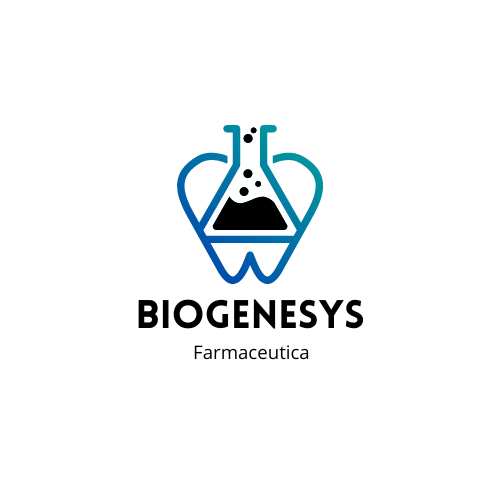

# 🌍 Expansión de Laboratorios Farmacéuticos Biogenesys en América Latina 💉

  

## Descripción

Este repositorio contiene los análisis y resultados de un proyecto para identificar ubicaciones estratégicas para la expansión de laboratorios farmacéuticos **Biogenesys** en América Latina. El análisis se centró en seis países clave: **Colombia**, **Argentina**, **Chile**, **México**, **Perú** y **Brasil**.

## Informe

El informe detalla un análisis exhaustivo de datos que abarca aspectos fundamentales como la **incidencia de COVID-19**, **tasas de vacunación** y **infraestructura sanitaria** disponible en los países seleccionados. Se aplicaron técnicas avanzadas de análisis de datos y visualización para identificar patrones y tendencias relevantes, permitiendo recomendar las ubicaciones más adecuadas para la expansión de laboratorios y centros de vacunación.

## Metodología

El proyecto se llevó a cabo en cuatro etapas:

1. **Carga y Transformación de Datos:** Carga de un conjunto de datos extenso, filtrado por los países de interés, y gestión de valores nulos para garantizar la coherencia de los tipos de datos.
2. **Análisis Exploratorio:** Análisis exploratorio detallado y creación de visualizaciones interactivas para identificar patrones y tendencias relevantes.
3. **Análisis Estadístico:** Uso de herramientas como Python, NumPy, Pandas, Seaborn y Matplotlib para un análisis profundo, explorando correlaciones entre variables clave.
4. **Creación de Dashboard:** Establecimiento de conexión con Power BI y diseño de un dashboard interactivo, dinámico y fácil de usar.

## Tecnologías Utilizadas

- **Python** 🐍
- **Power BI** 📊
- **NumPy** 🔢
- **Pandas** 📈
- **Seaborn** 📉
- **Matplotlib** 📍
- **Folium** 🗺️

---

💼 **¿Buscas un analista de datos con experiencia en análisis de datos, visualización y dashboard?** ¡No dudes en contactarme a **lavergnealdana@gmail.com** para explorar cómo puedo ayudarte a alcanzar tus objetivos con análisis de datos precisos y útiles! 📩
